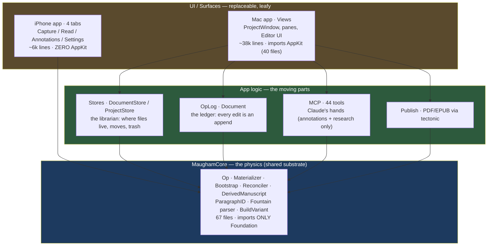
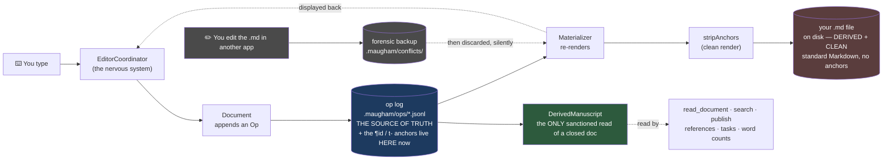
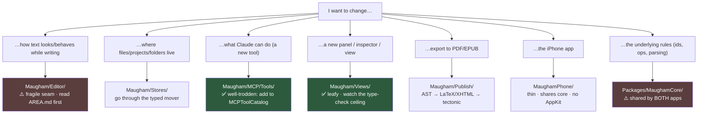
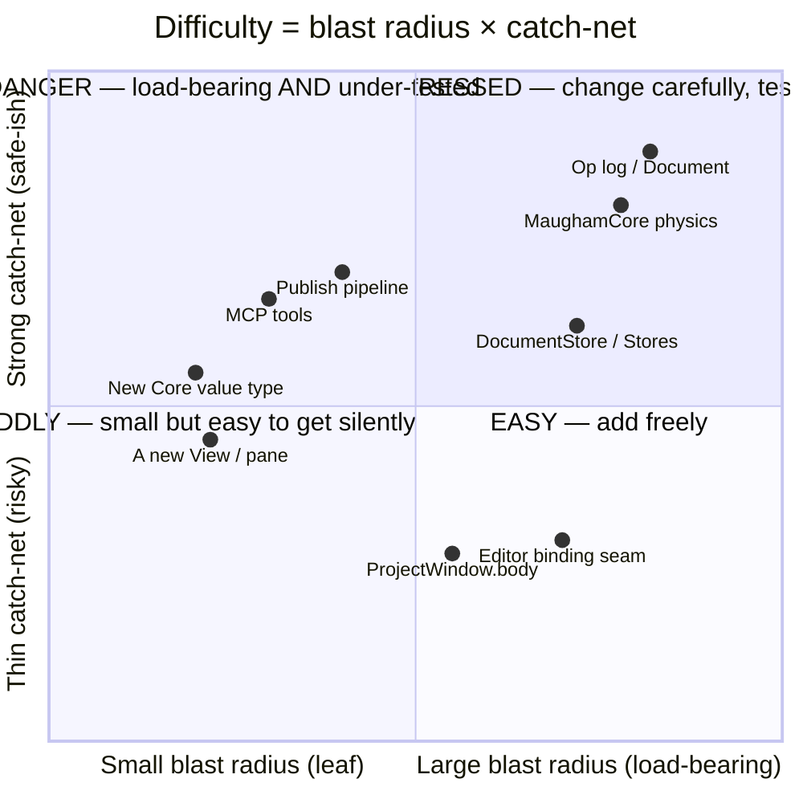

# Mental maps of the Maugham codebase

*A thinking-aid for the writer who owns this code but doesn't read it. Claude touches the
code; these are the maps **you** hold so you can steer, scope, and sanity-check.*

The premise: you never read Swift. But you still need a *spatial* model of the machine — enough
to ask "is this change small or scary?", "what else might it break?", and "are we painting
ourselves into a corner?" without opening a single file.

Good news: this repo is already heavily annotated in prose (`CLAUDE.md`, 7 `AREA.md` files,
19 ADRs). These maps just turn that prose into pictures, grounded in real numbers measured
from the tree (748 Swift files, ~51k lines of app+core code, ~45k lines of tests, ~2,200 tests).

There are **four** maps worth holding. Each answers a different question.

---

## What moved since these maps were first drawn (2026-06-09 → 2026-07-01)

Three weeks, three ADRs, and one of the four maps needed real surgery. The **shape** held; the
**spine got sharper**. If you only read one delta, read this:

- **ADR 0018 — reads now derive from the op log, never the `.md`.** An audit found *9 places* that
  read a manuscript file off disk and trusted it (including `read_document`, search, the publish
  pipeline). All rerouted through one new read primitive, `DerivedManuscript`. The `.md` is now
  *never* read back as truth.
- **ADR 0019 — the `.md` on disk is now clean.** The internal `¶id` / `t-` anchors that used to
  live inline in your `chapter.md` are gone from the file — they live *only* in the op log and in
  memory now. Your files are finally standard, `git diff`-clean Markdown/Fountain. (This **refines
  a hard invariant**: "anchors are the join key" is still true, but *in the op log*, not on disk.)
- **ADR 0019 also deleted the conflict sheet.** The old cross-device "conflict? pick a side" UI was
  found vestigial and removed wholesale. An external `.md` edit is now **silently discarded** — the
  bytes are snapshotted forensically under `.maugham/conflicts/` and the op-log truth is
  re-materialised over them, no UI. This is why **Map 2 below changed the most**.
- **ADR 0017 — an editor control plane** landed under the fragile Editor seam. Predictably, the
  Editor was the *single most-churned zone* of the three weeks (`EditorCoordinator` alone: 26
  commits). That's Map 4's "most important flinch" earning its label in real git history.

Numbers drifted up across the board: **657→748** Swift files, **43→44** MCP tools, **15→19** ADRs,
**~55→~93** OpLog+Core test files. The counts below reflect the 2026-07-01 tree.

---

## Map 1 — The Layer Cake · "What sits on what?"

This is the single most important map, and the cheapest to keep in your head. It answers:
*if I change something down low, how much sits on top of it?*

**How to read it.** Arrows mean "depends on / is built from." Everything points *down*.
Nothing in `MaughamCore` points back up — measured fact: the entire core imports nothing but
`Foundation` (plus `Security`/`CryptoKit` in two files). That one-way-ness is the whole game.

**The rule this gives you:**
- **Change at the top (Views, a pane, an MCP tool)** = blast radius is roughly *one screen* or
  *one tool*. 126 Mac files and 24 phone files lean *on* the core, so a UI tweak rarely reaches them.
- **Change at the bottom (`MaughamCore`)** = potentially *everything* shifts at once, on *both*
  the Mac and the iPhone. The core is shared by both apps, so a core change is a two-platform change.
- The iPhone is a thin shell: ~6k lines, and it sits **directly** on the core with no AppKit at
  all (measured: zero AppKit imports). That's why the phone is cheap to extend but can only do
  what the core already exposes.

When you ask Claude for a feature, your first instinct should be: *which layer does this live in?*
That alone predicts cost.

---

## Map 2 — The Spine · "How does my writing flow through the machine?"

The one data path that matters. If you understand this, you understand why "the `.md` file is not
the truth" and why editing-outside-Maugham gets discarded. **This is the map that changed most in
the last three weeks** — ADR 0018 and 0019 made the op log even more exclusively the truth.

**How to read it.** The blue box (op log) is the real document — and as of ADR 0019 it's the *only*
place the internal `¶id` / `t-` anchors live. The red box (`.md`) is now a **clean printout**:
standard Markdown/Fountain with none of Maugham's join-keys in it, so it's finally readable in
pandoc and clean in `git diff`. The green box (`DerivedManuscript`, ADR 0018) is the new front door
for *reading* a closed document — everything that used to peek at the `.md` (search, publish,
`read_document`, the reference graph) now derives from the ledger instead.

**Why this map earns its keep:** almost every "weird data behaviour" question you'll ever have
("why didn't my edit on the other device win?", "where did my checkpoint go?", "why did my
outside-Maugham edit vanish?") is answered by *where on this spine the thing happened*. Sync, undo,
time-travel, and conflict-resolution are all just different ways of replaying or merging this ledger.

**What changed about the "blown away" story:** it used to route through a cross-device **conflict
sheet** (pick-a-side UI). ADR 0019 found that sheet vestigial and *deleted it*. Now an external
`.md` edit is handled uniformly and **silently**: the bytes are snapshotted forensically under
`.maugham/conflicts/` (so an accidental edit is recoverable) and the op-log truth is re-materialised
straight over them — no dialog, no choice, no exceptions. Cross-device merging still happens, but
entirely through the *op-log* merge, never the `.md`.

**The fragile detail to remember:** the editor still has one narrow seam for pushing whole-document
text in from outside normal typing (`applyExternalText`, used for cloud-conflict resolution). It's
guarded by tripwires precisely because extra callers cause cursor races. You don't need the caller
count — you just need to **flinch if a change description ever sounds like "also feed text into the
editor from somewhere new."**

---

## Map 3 — The Surface Map · "I want feature X — where does it live?"

This is your *navigation* map: a feature-to-place lookup so you can point Claude at the right
neighbourhood and predict who else lives there.

**How to read it.** Each leaf is a real directory. The ones flagged red (`Editor/`, `MaughamCore/`)
are where care is required; the green ones (`MCP/Tools/`, `Views/`) are where the codebase *wants*
to be extended — they have established "add one more" patterns.

The useful meta-fact: **every red directory already has an `AREA.md`** — a written briefing on its
traps. There are 7 of them (`Editor`, `OpLog`, `Stores`, `Views`, `MCP`, `Updates`, `MaughamPhone`).
When you aim Claude at a red zone, "read the AREA.md first" is the seatbelt.

---

## Map 4 — The Easy/Hard Map · "Is this change small or scary?"

This is the one you actually asked for: *how do I know what's easy or hard to evolve?* Difficulty
isn't one number — it's **two**, and they're both measurable from the repo:

- **Blast radius** (horizontal): how many other things lean on this? (≈ how many files reference it.)
- **Catch-net** (vertical): if Claude gets it subtly wrong, will the tests scream — or will a bug
  ship silently? (≈ how dense the tests are around it.)

**How to read it — quadrant by quadrant:**

- **Bottom-right (EASY).** New panes, new MCP tools, new value types. The codebase has paved
  roads here: adding an MCP tool is "implement the protocol, add it to one catalog, done"
  (that's why there are already 44). Cost is low and predictable. *When you have an idea, hope it
  lands here.*

- **Top-left (HARD but FORTRESSED).** The op log and the core physics. These are load-bearing —
  touch them and a lot moves — **but** they're wrapped in the densest tests in the repo (the
  `OpLog` and `Core` test folders hold ~93 of the ~380 test files). So changes are *expensive to
  design* but *hard to get silently wrong*. The CLAUDE.md note "OpLog is the cleanest area — don't
  refactor structurally" is the human version of this: high value, leave the structure alone, extend
  at the edges.

- **Bottom-left / top-of-bottom (FIDDLY & DANGER — the seam to fear).** The **Editor binding seam**
  (`EditorHost` ↔ `EditorSurface` ↔ `EditorCoordinator`). It isn't the biggest thing in the repo,
  but it sits low-ish *and* it's historically where bugs ship silently — "three separate cursor
  races in 24 hours" is a real quote from the tripwire table. Four of the 19 documented tripwires
  live here. This is the one zone where "it compiles and looks fine" has repeatedly *not* meant
  "it's correct." **This is your single most important flinch.**

- **Top-right (careful — Publish, parts of Stores).** Moderately load-bearing, decently tested.
  Normal caution.

**The evolution tell:** where does change *actually* happen? Over the last three weeks the
most-churned files were `EditorCoordinator.swift` (26 commits), `EditorSurface.swift`,
`EditorHost.swift`, `ProjectWindow.swift`, and `Document.swift` — the Editor seam and the main
window. That's two useful signals at once. **First**, git history put its heaviest traffic *right
on Map 4's danger zone* (the Editor binding seam) — the ADR 0017 "editor control plane" work — which
is exactly why "don't merge the Editor on tests-pass alone" stays the standing rule. **Second**, the
op log/core *did* see a real burst of change (ADR 0018/0019), which looks against-the-grain until
you notice its shape: it was a **test-first correctness campaign** (a new `DerivedManuscript`
primitive, a tripwire test, ~40 new OpLog/Core test files), not a structural refactor. That's the
*sanctioned* way to touch the top-left quadrant — extend behind dense tests, don't restructure. When
you see a proposed core change that is a rewrite rather than a guarded extension, *that's* the
against-the-grain move worth a "are we sure?" before greenlighting.

---

## How to actually *use* these maps (as the non-coder)

1. **Triage every request through Map 1 first.** "Which layer?" Top = cheap, bottom = two-platform
   and expensive. This is 80% of the value.

2. **Use Map 3 to point Claude at the neighbourhood** and to ask the right follow-up: *"does this
   touch a red zone? If so, did you read the AREA.md?"*

3. **Use Map 4 to set your own anxiety dial.** If Claude says a change lives in MCP tools or a new
   pane, relax. If it says "Editor binding" or "op log invariants," slow down, ask for the smoke
   test, and don't merge on "tests pass" alone for the Editor seam specifically.

4. **Watch for against-the-grain moves.** A diff that edits `project.pbxproj`, adds a 5th caller to
   `applyExternalText`, reaches *up* from the core, or structurally refactors the op log — each of
   those contradicts a documented invariant. You don't need to read code to ask *"the notes say
   don't do X — are we sure?"*

## What would make these maps even more useful (possible next steps)

- **A live version of Map 1** generated from the import graph, so the layering is checked, not
  drawn from memory. (The data's already here — `import` statements are machine-readable.)
- **A "blast radius" lookup**: point at any feature, get the list of files that lean on it, so
  "what else might this break?" stops being a judgement call.
- **Pin Map 4 to CI**: when test density around a hot file drops, that file slides toward the
  DANGER quadrant — that's a signal worth surfacing automatically.

*These maps are descriptive, not generated — they reflect the tree as measured on 2026-07-01
(first drawn 2026-06-09; re-measured after ADRs 0017/0018/0019 merged). The numbers drift — they
already have once. The **shape** (one-way layering, a single op-log spine that keeps getting
*more* exclusive, a fragile editor seam, paved roads for tools and panes) is the stable part worth
memorising. The one structural update this pass: the spine's `.md` end is now a genuinely clean,
read-only printout — the truth has fully retreated into the op log.*
