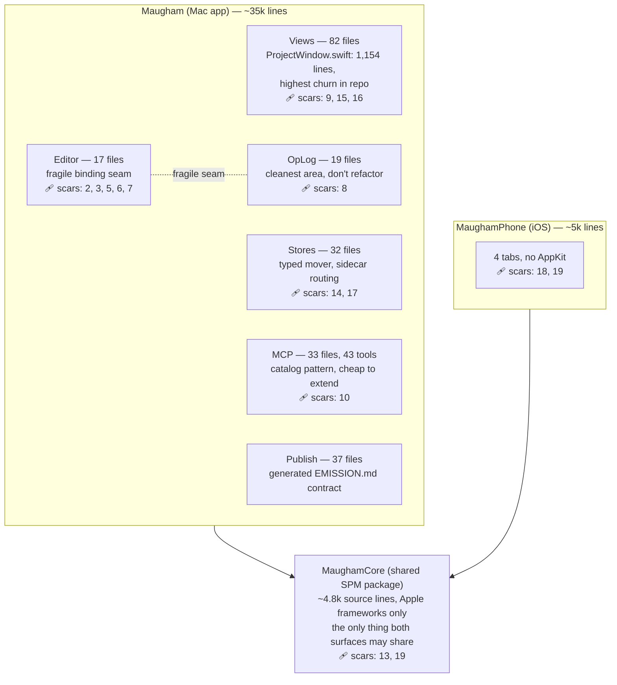
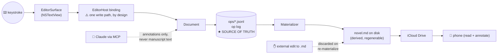

# Mental maps for a non-coding owner

*2026-06-09. Thinking note: what mental models and visualizations are useful for the owner of
a codebase they never read directly, using Maugham itself as the worked example.*

## The premise

When you don't read the code, the useful maps are not code maps. A class diagram answers
"how is this implemented?" — a question you've delegated. The questions you still own are:

1. **What does the system promise?** (invariants)
2. **Where does my data live and what touches it?** (data flow + trust boundaries)
3. **Where is change cheap and where is it expensive?** (territory + scar tissue)
4. **What past decisions does my new idea collide with?** (decision history)

Maugham is unusually far along here: CLAUDE.md's invariants, the tripwire table, AREA.md
files, and the ADRs *are* these maps, in prose. What follows is their visual form.

## Map 1 — The territory (zoning) map

Districts with different building codes. Size ≈ lines of code; the scar count is how many
tripwires point at the area — a direct proxy for "changes here have hurt before."



Reading it: the dependency arrows are honest (Core depends on nothing third-party; both
apps depend on it; the apps never depend on each other). Scar density tells you the
Editor↔OpLog seam is the most expensive district per line of code, while MCP is the
cheapest place to add capability.

Test mass is the other zoning fact: ~31k lines of Mac tests against ~35k lines of Mac app
code (~1:1). That ratio is the owner's safety instrument — watch it per-area, not globally.

## Map 2 — Where a keystroke goes (data flow + trust boundary)

The single most important picture for this app, because the #1 invariant is about it.



Everything right of the star is disposable; everything left of it is live state. The two
dotted arrows are the trust boundaries — the things deliberately *not* allowed to mutate
the manuscript. When evaluating a feature request, ask where on this line it sits: the
further left, the more dangerous.

## Map 3 — Promises and their enforcement

The owner's review unit is not the diff; it's this table. A promise without an enforcement
column is a wish.

| Promise | Enforced by | You'd notice a break via |
|---|---|---|
| Op log is source of truth; external `.md` edits discarded | Bootstrap/Reconciler + `BootstrapWiringTests` | Smoke test: edit `.md` outside, reopen |
| Plain text on disk; derived data under `.maugham/` | Convention + store review | `ls` your project folder |
| MCP never mutates manuscript text | Tool catalog scope | Annotation appears, prose unchanged |
| ⌘S = labeled checkpoint, autosave = real save | `DocumentStore` debounce | ⌘Q without ⌘S, text survives |
| No raw move/delete of user content | `TripwireGrepTests` (compile-adjacent grep) | Phantom-file regression |
| No hardcoded variant strings | `TripwireGrepTests` + `TripwirePhoneGrepTest` | Split-build bug |
| Mac/phone share one implementation | Cross-surface contract registry + round-trip tests | Phone shows "No open annotations" |

The grep-test pattern (a test that searches the source for forbidden spellings) is the
codebase's most owner-legible enforcement idea: each scar becomes a machine check, not a
memory.

## Map 4 — The cost map (shape of ask → price)

| Shape of the ask | District | Cost / risk |
|---|---|---|
| New MCP tool / Claude capability | MCP catalog | **Cheap.** Established pattern, additive |
| New Codable type, small struct, pane | Models / Views | **Cheap–medium.** Watch scar 15 (layout collapse) |
| New pane or window layout change | Views (`ProjectWindow`) | **Medium.** Type-checker ceiling; Release build check required |
| Anything touching typing, cursor, focus | Editor seam | **Expensive.** 5 scars; races are temporal, tests are the only net |
| Cross-device / sync semantics | OpLogStore + inbox | **Expensive.** Distributed behavior; iCloud merge is adversarial |
| New feature visible on Mac *and* phone | MaughamCore + both apps | **Multiplied.** One implementation, two test schemes |

## What's easy and hard to map in this codebase

**Easy** (structure matches behavior):

- The three-target layering is real, not aspirational — the dependency diagram is honest.
- The op-log pipeline is linear and its types are named after the diagram boxes
  (Bootstrap, Reconciler, Materializer, RenderFilter).
- The MCP surface is catalog-driven: enumerable, uniform, generatable.
- Publish already has the right idea fully realized: `EMISSION.md` is *generated from*
  `EmissionContract.swift` and test-enforced. Generated, test-checked documentation is the
  gold standard — maps that cannot drift.

**Hard** (structure hides behavior):

- **SwiftUI views.** `ProjectWindow.swift` is the biggest and highest-churn file, but a
  view-hierarchy diagram tells you almost nothing — the interesting structure is state
  ownership and invalidation, which is invisible statically.
- **The Editor seam.** Its fragility is *temporal* (binding write ordering, focus races,
  async ticks). Static diagrams can't draw a race; per-scenario sequence diagrams and the
  harness tests are the only true maps.
- **Sync semantics** (ADR 0012, conflict twins, monotonic `writtenAt`) — distributed
  behavior over time resists any single picture.
- **The filesystem contract.** The `.maugham/` directory layout is an interface shared by
  Mac, phone, iCloud, and MCP, but nothing renders it as a schema. A generated
  "filesystem schema" doc (the EMISSION.md treatment) would be the highest-value new map.

## How the owner's craft evolves

1. **From reading code to reading contracts.** Review the spec, the test names, the
   invariant table, and the smoke test — not the diff.
2. **Speak in districts and seams.** "Is this an MCP-shaped ask or an Editor-seam ask?"
   predicts cost better than feature size does.
3. **Curate the maps as the product.** CLAUDE.md, AREA.md, ADRs, tripwires — keeping these
   true *is* the owner's codebase work. Every incident → a tripwire; every decision → an ADR.
4. **Demand generated maps over drawn ones.** A hand-drawn diagram is stale the week after.
   Prefer EMISSION.md-style artifacts: emitted from code, enforced by a test.
5. **Watch leading indicators, not snapshots:** size growth of hotspot files, per-area
   test ratio, scar count per district, and the Release-build budget near `ProjectWindow`.

---

# Part 2 — The two artifacts: the Atlas and the Change Card

*Added 2026-06-09, second pass. The owner wants exactly two things: (1) current state of
the project, and (2) a per-change visualization + natural-language description — both
drillable. They are the same structure at two timescales.*

## The unifying shape: an altitude ladder

Both artifacts are a four-level ladder. Each level answers one owner question; each level
links down; the bottom level is **conversational, not a document** — the deepest
drill-down is asking Claude, not reading a file.

| Level | Question | Current state ("Atlas") | Per-change ("Change Card") |
|---|---|---|---|
| L0 | What is it / what changed *for the writer*? | One screen: zoning map + paragraph + health numbers | One sentence + map with touched districts lit up |
| L1 | What does it mean *for the system*? | Per-district page: promises, scars, hotspots | Kind of change, risk class, invariants in scope, test delta |
| L2 | What's the structure of it? | Per-seam page: flow diagrams, contract rows | The commit narrative (the sequence already tells a story) |
| L3 | Show me exactly | — | The diff |
| L∞ | Anything else | "Claude, how does X work?" | "Claude, why did you do it this way?" |

Two design rules make the ladder trustworthy:

1. **Every number is computed, never typed.** The Atlas regenerates its numbers (LOC,
   test ratio, scar counts, churn heat) from the repo; only the prose layer ("what this
   district means") is curated, and it changes rarely. This is the EMISSION.md principle
   applied to the whole project.
2. **The base map never changes.** The same zoning map renders every time; a change is a
   *delta on a constant background*. Your eye learns the map once, then reads change as
   highlighting. This is how weather maps work.

## The Atlas (current state)

- **L0** is one screen: the territory map from Part 1 with live numbers, plus a paragraph
  of state ("v0.6.1 shipped; cross-surface contracts baseline done; inline emphasis
  contract just merged; open concerns: Annotations/History onboarding affordance").
  Map colors = churn over the last N change cards, so "current state" includes "where the
  action is."
- **L1** per district = AREA.md + computed vitals (size, scar list, hotspot files, last
  10 changes touching it). The prose half already exists; only the vitals are new.
- **L2** per seam = the keystroke map, the `.maugham/` filesystem schema, the MCP catalog,
  the promise–enforcement matrix.
- **Refresh trigger:** regenerate at release cut (hook in `cut-release.sh`) and on demand.

## The Change Card (per change)

The unit is the **milestone** (merge commit / tagged arc), not the commit — commits are
its L2. Below, a real one, built from the actual inline-emphasis milestone
(`4dd6cb4..a405b0b`, merged 2026-06-09):

> ### Change card: Inline emphasis contract
> **For the writer (L0):** Bold and italic now combine and nest — `***bold italic***`,
> `**bold *with italic* inside**` — and render identically in the Mac prose editor,
> screenplay mode, and the phone reader.
>
> ```mermaid
> flowchart TB
>     subgraph mac["Maugham (Mac)"]
>         VIEWS["Views"]:::cold
>         EDITOR["Editor ◉ tokenizer wired to scanner"]:::hot
>         OPLOG["OpLog"]:::cold
>         STORES["Stores"]:::cold
>         MCP["MCP"]:::cold
>         PUBLISH["Publish"]:::cold
>     end
>     subgraph phone["MaughamPhone"]
>         READ["Read ◉ per-sub-run font fix"]:::hot
>     end
>     CORE["MaughamCore ◉◉ new: EmphasisTraits,<br/>InlineEmphasisScanner (shared contract)"]:::hot
>     mac --> CORE
>     phone --> CORE
>     classDef hot fill:#e8590c,color:#fff
>     classDef cold fill:#dee2e6,color:#888
> ```
>
> **For the system (L1):**
> - **Kind:** new cross-surface contract pushed *down* into MaughamCore; both surfaces
>   consume one scanner. Registered in the cross-surface contract registry.
> - **Risk class:** touched the Editor district (expensive — scars 2/3/6/7 in scope) and
>   both render paths; mitigated by pinning the scanner to Apple's parser on canonical
>   cases before wiring either surface.
> - **Shape of the work:** 261 source lines, **316 test lines** (tests > source), 932
>   docs lines (spec + plan written first).
> - **Invariants touched:** none of the hard invariants; adds one new contract row.
>
> **The story (L2):** spec → plan → `EmphasisTraits` → scanner + parser-pinning tests →
> fountain path → phone sub-run fix → prose path → per-line scan fix (emphasis must not
> span line breaks) → docs + registry. *(12 commits; each line links to its commit.)*

### What's automatable vs. what needs the author

Computable from the diff alone (a ~60-line script): districts touched (path → district is
clean in this repo — the directory structure *is* the zoning), risk class (district →
scar table), source/test/docs line split, spec/plan linkage (paths under
`docs/superpowers/`), invariants in scope (path heuristics). The merge-commit + 
conventional-commit discipline already delimits milestones and types each step.

**Not** reconstructable later: the L0 writer-visible sentence and the *why*. Those must be
written by the author at change time — which costs nothing here, because Claude is the
author and already writes specs and release notes. The convention is simply: finishing a
milestone includes emitting its change card (structured front matter so the Atlas can
aggregate them).

### The loop

The Atlas is the fold of all change cards: card districts → churn heat on the L0 map;
card contracts → new rows in the promise matrix; card risk notes → candidate tripwires.
Current state isn't a separate artifact to maintain — it's what the change cards sum to,
plus curated prose that changes rarely.

### Easy / hard, this repo specifically

**Easy:** path→district mapping is unambiguous; conventional commits + merge milestones
already structure the narrative; intent is already written down *at change time* (specs,
plans, release notes) — most repos lack exactly this, and it's the hard part.

**Hard:** Views-district changes resist this format — "Editor district lit up" says little
about a layout fix; the right L1 for UI changes is a before/after screenshot, which
requires running the app (attach from the manual smoke pass, or a future automated
verify). And cloud clones are shallow, so cards can't be backfilled for old history —
start the convention now and coverage accrues forward.
