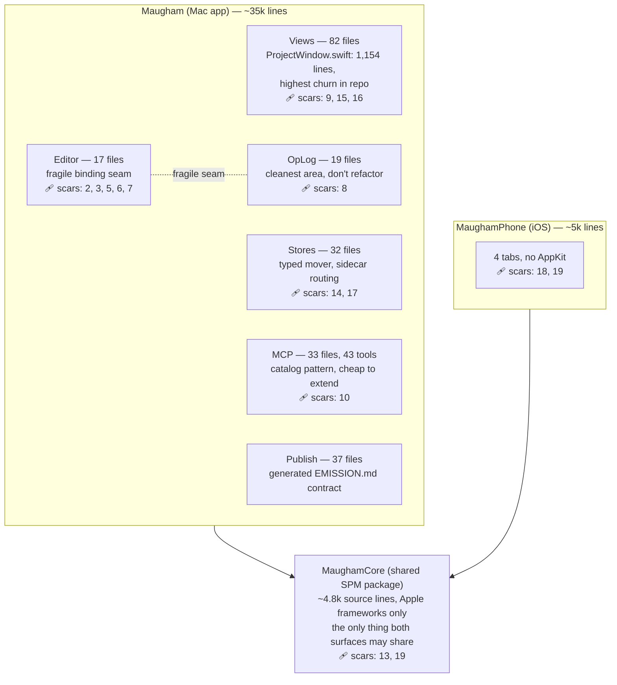
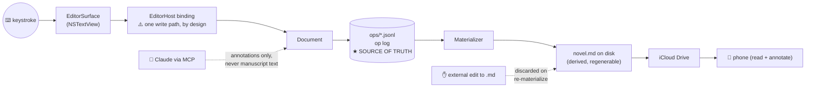

# Mental maps for a non-coding owner

*2026-06-09. Thinking note: what mental models and visualizations are useful for the owner of
a codebase they never read directly, using Maugham itself as the worked example.*

## The premise

When you don't read the code, the useful maps are not code maps. A class diagram answers
"how is this implemented?" — a question you've delegated. The questions you still own are:

1. **What does the system promise?** (invariants)
2. **Where does my data live and what touches it?** (data flow + trust boundaries)
3. **Where is change cheap and where is it expensive?** (territory + scar tissue)
4. **What past decisions does my new idea collide with?** (decision history)

Maugham is unusually far along here: CLAUDE.md's invariants, the tripwire table, AREA.md
files, and the ADRs *are* these maps, in prose. What follows is their visual form.

## Map 1 — The territory (zoning) map

Districts with different building codes. Size ≈ lines of code; the scar count is how many
tripwires point at the area — a direct proxy for "changes here have hurt before."

Reading it: the dependency arrows are honest (Core depends on nothing third-party; both
apps depend on it; the apps never depend on each other). Scar density tells you the
Editor↔OpLog seam is the most expensive district per line of code, while MCP is the
cheapest place to add capability.

Test mass is the other zoning fact: ~31k lines of Mac tests against ~35k lines of Mac app
code (~1:1). That ratio is the owner's safety instrument — watch it per-area, not globally.

## Map 2 — Where a keystroke goes (data flow + trust boundary)

The single most important picture for this app, because the #1 invariant is about it.

Everything right of the star is disposable; everything left of it is live state. The two
dotted arrows are the trust boundaries — the things deliberately *not* allowed to mutate
the manuscript. When evaluating a feature request, ask where on this line it sits: the
further left, the more dangerous.

## Map 3 — Promises and their enforcement

The owner's review unit is not the diff; it's this table. A promise without an enforcement
column is a wish.

| Promise | Enforced by | You'd notice a break via |
|---|---|---|
| Op log is source of truth; external `.md` edits discarded | Bootstrap/Reconciler + `BootstrapWiringTests` | Smoke test: edit `.md` outside, reopen |
| Plain text on disk; derived data under `.maugham/` | Convention + store review | `ls` your project folder |
| MCP never mutates manuscript text | Tool catalog scope | Annotation appears, prose unchanged |
| ⌘S = labeled checkpoint, autosave = real save | `DocumentStore` debounce | ⌘Q without ⌘S, text survives |
| No raw move/delete of user content | `TripwireGrepTests` (compile-adjacent grep) | Phantom-file regression |
| No hardcoded variant strings | `TripwireGrepTests` + `TripwirePhoneGrepTest` | Split-build bug |
| Mac/phone share one implementation | Cross-surface contract registry + round-trip tests | Phone shows "No open annotations" |

The grep-test pattern (a test that searches the source for forbidden spellings) is the
codebase's most owner-legible enforcement idea: each scar becomes a machine check, not a
memory.

## Map 4 — The cost map (shape of ask → price)

| Shape of the ask | District | Cost / risk |
|---|---|---|
| New MCP tool / Claude capability | MCP catalog | **Cheap.** Established pattern, additive |
| New Codable type, small struct, pane | Models / Views | **Cheap–medium.** Watch scar 15 (layout collapse) |
| New pane or window layout change | Views (`ProjectWindow`) | **Medium.** Type-checker ceiling; Release build check required |
| Anything touching typing, cursor, focus | Editor seam | **Expensive.** 5 scars; races are temporal, tests are the only net |
| Cross-device / sync semantics | OpLogStore + inbox | **Expensive.** Distributed behavior; iCloud merge is adversarial |
| New feature visible on Mac *and* phone | MaughamCore + both apps | **Multiplied.** One implementation, two test schemes |

## What's easy and hard to map in this codebase

**Easy** (structure matches behavior):

- The three-target layering is real, not aspirational — the dependency diagram is honest.
- The op-log pipeline is linear and its types are named after the diagram boxes
  (Bootstrap, Reconciler, Materializer, RenderFilter).
- The MCP surface is catalog-driven: enumerable, uniform, generatable.
- Publish already has the right idea fully realized: `EMISSION.md` is *generated from*
  `EmissionContract.swift` and test-enforced. Generated, test-checked documentation is the
  gold standard — maps that cannot drift.

**Hard** (structure hides behavior):

- **SwiftUI views.** `ProjectWindow.swift` is the biggest and highest-churn file, but a
  view-hierarchy diagram tells you almost nothing — the interesting structure is state
  ownership and invalidation, which is invisible statically.
- **The Editor seam.** Its fragility is *temporal* (binding write ordering, focus races,
  async ticks). Static diagrams can't draw a race; per-scenario sequence diagrams and the
  harness tests are the only true maps.
- **Sync semantics** (ADR 0012, conflict twins, monotonic `writtenAt`) — distributed
  behavior over time resists any single picture.
- **The filesystem contract.** The `.maugham/` directory layout is an interface shared by
  Mac, phone, iCloud, and MCP, but nothing renders it as a schema. A generated
  "filesystem schema" doc (the EMISSION.md treatment) would be the highest-value new map.

## How the owner's craft evolves

1. **From reading code to reading contracts.** Review the spec, the test names, the
   invariant table, and the smoke test — not the diff.
2. **Speak in districts and seams.** "Is this an MCP-shaped ask or an Editor-seam ask?"
   predicts cost better than feature size does.
3. **Curate the maps as the product.** CLAUDE.md, AREA.md, ADRs, tripwires — keeping these
   true *is* the owner's codebase work. Every incident → a tripwire; every decision → an ADR.
4. **Demand generated maps over drawn ones.** A hand-drawn diagram is stale the week after.
   Prefer EMISSION.md-style artifacts: emitted from code, enforced by a test.
5. **Watch leading indicators, not snapshots:** size growth of hotspot files, per-area
   test ratio, scar count per district, and the Release-build budget near `ProjectWindow`.
